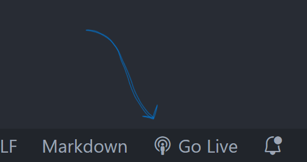

# UC Berkeley Extension: Prework Module

Ryan England

## Description

The goals of this module are to:

- Familiarize ourselves with HTML, CSS, Git, and JavaScript enough to prepare us for the session coursework.
- Build healthy habits to promote learning and a growth mindset.
- Set up our local machines to prepare ourselves for the specific type of coding disciplines taught in this course.
- Learn about where to find industry-leading literature and how to apply that to our lives as developers.

## Installation

No installation process is required to access this information. Simply pull the files from the GitHub repository and the "installation" will be complete.

## Usage

Utilizing the respository is a simple process. In VS Code, the bottom right corner of the window should have a button labeled "Go Live". Click this to open the website on a local web server.

## Credits

- Ryan England (GitHub: [stellyes](https://github.com/stellyes))
- W3 Schools (Specific use of the <[code](https://www.w3schools.com/TAGs/tag_code.asp)> tag)

## License

This project is licensed under a GNU GPL-3.0 license. For more information, please refer to the file in the repository or visit [choosealicense.com](https://choosealicense.com/licenses/gpl-3.0/)

## Badges

Front-end development is not something I've spent a lot of time working on for myself. I'm most comfortable with back-end development as it concerns web applications and some local applications. I spent a year with a company located in Camarillo, CA learning and developing software solutions using the AWS platform. My specialties mostly pertain to web-crawling (Selenium), data-collection, CI/CD through AWS Amplify, and REST-ful API Development through AWS API Gateway v2. I am especially excited to continue developing my skills with HTML, CSS, and JavaScript and be able to confidently be a full-stack developer

## Features

For the time being, this code base does not have any user interractivity. The user can simply open the webpage, and refresh their browser if they wish to potentially see different results in the console.
